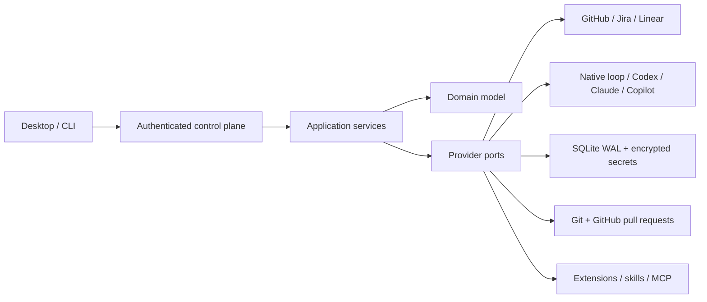

# Architecture

Fable uses ports and adapters so providers and user interfaces can evolve without becoming the orchestration kernel.

## Runtime boundaries

- Domain: normalized work items, run states, workflows, budgets, events, permissions, and provider capabilities. It imports no application or infrastructure code.
- Application: orchestration, scheduling, workflow execution, native agent loop, policy, hooks, budgets, and registries. It depends only on domain and ports.
- Adapters: HTTP/GraphQL providers, coding-agent SDK/CLI integrations, SQLite, workspaces, Git, tools, extensions, MCP, and deterministic fakes.
- Composition: validates layered YAML, resolves secret references, registers adapters, loads workflows/extensions/MCP, and starts recovery/scheduling.
- Control surfaces: CLI and authenticated local API. The React renderer talks only to that API and never imports provider SDKs or persistence.

An executable architecture test rejects imports that invert these dependencies.

## Process model

The Tauri host starts a target-specific `fable-control-plane` sidecar on an ephemeral loopback port, reads one JSON readiness line, retains its child handle, and terminates it on application exit. A random bearer token is sent to the renderer over a Tauri command result, not through command-line arguments or a persisted file. Browser development can connect to a separately started service by saving its URL/token.

## Autonomous run sequence

1. A manual request or scheduler discovers an eligible normalized item.
2. A deterministic dispatch record and provider/local claim prevent duplicate work.
3. The orchestrator creates a run, applies claim/workspace hooks, and provisions a local, temporary, clone, or Git-worktree workspace.
4. The workflow engine executes the dependency graph with retries, conditions, parallel ready steps, approvals, timeouts, and cancellation.
5. Agent steps use either the native model/tool loop or a supported external coding agent in a separate session.
6. Delivery actions stage, commit, push, and open a draft pull request after policy and optional human approval.
7. Run state, workflow snapshots, claims, dispatch attempts, approvals, agent sessions, and structured events are persisted.
8. The work item is transitioned and claims/workspaces are released according to retention policy.

Terminal outcomes are explicit: `GOAL_COMPLETED`, `GOAL_BLOCKED`, `BUDGET_EXHAUSTED`, `POLICY_BLOCKED`, `HUMAN_INPUT_REQUIRED`, `FATAL_FAILURE`, or `CANCELLED`.

## Persistence and recovery

SQLite runs in WAL mode with migrations, optimistic entity versions, durable event ordering, and expiring claims. Startup reconciliation marks interrupted active runs failed, expires pending approvals, and moves interrupted scheduler dispatches to retry or exhausted state. Scheduler retries are bounded exponential backoff with deterministic source/item keys and configured global concurrency.

## Why Tauri

Tauri keeps the desktop host small and grants renderer capabilities explicitly. The service boundary also preserves a future path to a remote worker or headless deployment without rewriting the UI or core. See ADRs 0001–0009 for the evaluated alternatives and consequences.
