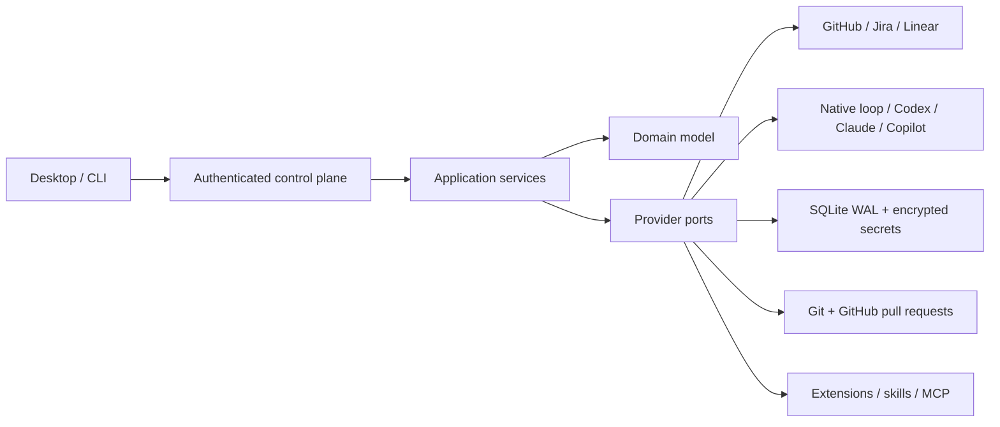

# Architecture

Fable uses ports and adapters so providers and user interfaces can evolve without becoming the orchestration kernel.

## Runtime boundaries

- Domain: normalized work items, run states, workflows, budgets, events, permissions, and provider capabilities. It imports no application or infrastructure code.
- Application: orchestration, scheduling, workflow execution, native agent loop, policy, hooks, budgets, and registries. It depends only on domain and ports.
- Adapters: HTTP/GraphQL providers, coding-agent SDK/CLI integrations, SQLite, workspaces, Git, tools, extensions, MCP, and deterministic fakes.
- Composition: validates layered YAML, resolves secret references, registers adapters, loads workflows/extensions/MCP, and starts recovery/scheduling.
- Control surfaces: CLI and authenticated local API. The React renderer talks only to that API and never imports provider SDKs or persistence.

An executable architecture test rejects imports that invert these dependencies.

## Process model

The Tauri host starts a target-specific `fable-control-plane` sidecar on an ephemeral loopback port, reads one JSON readiness line, retains its child handle, and terminates it on application exit. A random bearer token is sent to the renderer over a Tauri command result, not through command-line arguments or a persisted file. Browser development can connect to a separately started service by saving its URL/token.

## Autonomous run sequence

1. A manual request or scheduler discovers an eligible normalized item.
2. A deterministic dispatch record and provider/local claim prevent duplicate work.
3. The orchestrator creates a run, applies claim/workspace hooks, and provisions a local, temporary, clone, or Git-worktree workspace.
4. The workflow engine executes the pinned graph with typed outputs, declared joins, lifecycle actions, retries, conditions, parallel steps, durable waits, sub-workflows, timeouts, and cancellation.
5. Agent steps use either the native model/tool loop or a supported external coding agent in a separate session.
6. Delivery actions stage, commit, push, and open a draft pull request after policy and optional human approval.
7. Run state, graph position, immutable asset snapshot, execution-spec revisions, waits, claims, dispatch attempts, disposable session hints, and structured events are persisted.
8. The work item is transitioned and claims/workspaces are released according to retention policy.

Terminal outcomes are explicit: `GOAL_COMPLETED`, `GOAL_BLOCKED`, `BUDGET_EXHAUSTED`, `POLICY_BLOCKED`, `HUMAN_INPUT_REQUIRED`, `FATAL_FAILURE`, or `CANCELLED`.

## Persistence and recovery

SQLite runs in WAL mode with migrations, optimistic entity versions, durable event ordering, and expiring claims. Startup reconciliation preserves runs at durable wait checkpoints while failing genuinely interrupted, non-checkpointed execution. Responses resume the exact pinned node idempotently. Coding waits checkpoint and push a remote branch; replacement sessions reconstruct work from the recorded SHA. Scheduler retries are bounded, lane-aware, and rank-preserving.

## Phase 2 execution model

Four state layers remain distinct: immutable graph position, reserved engine lifecycle, user-defined domain state, and projected external work-item state. An immutable `ExecutionSpecification` records work, repository roles, instruction provenance, promoted context, tests, permissions, pinned assets, and completion requirements. Authoritative changes create revision N+1 and never rewrite history.

Workflows, sub-workflows, gate sets, rubrics, profiles, policies, and templates use `(kind, id, version, digest)` references. A run pins a resolved asset snapshot. Agents may return JSON checked against declared output contracts, but only the engine evaluates guards and transitions.

Repository resolution composes explicit metadata, conditional many-to-many rules, and discovery results with deterministic precedence. The primary binding provisions the workspace; all roles remain in the execution specification. Scoped instruction files and 1-up/1-down relationship context are rediscovered on resume. Attachments remain disabled unless a workflow declares type/count/byte limits.

## Federated desktop

The desktop is a control surface over independent runtimes. Records and commands retain their owning runtime, failures are isolated, and UI-only groups filter the aggregate view. Runtimes do not share persistence, credentials, queues, repositories, or workspace authority. The embedded sidecar remains loopback-only; remote runtimes are reached through HTTPS or a loopback tunnel.

## Why Tauri

Tauri keeps the desktop host small and grants renderer capabilities explicitly. The service boundary supports remote/headless runtimes without rewriting the UI or core. See ADRs 0001–0013 for the evaluated alternatives and consequences.
